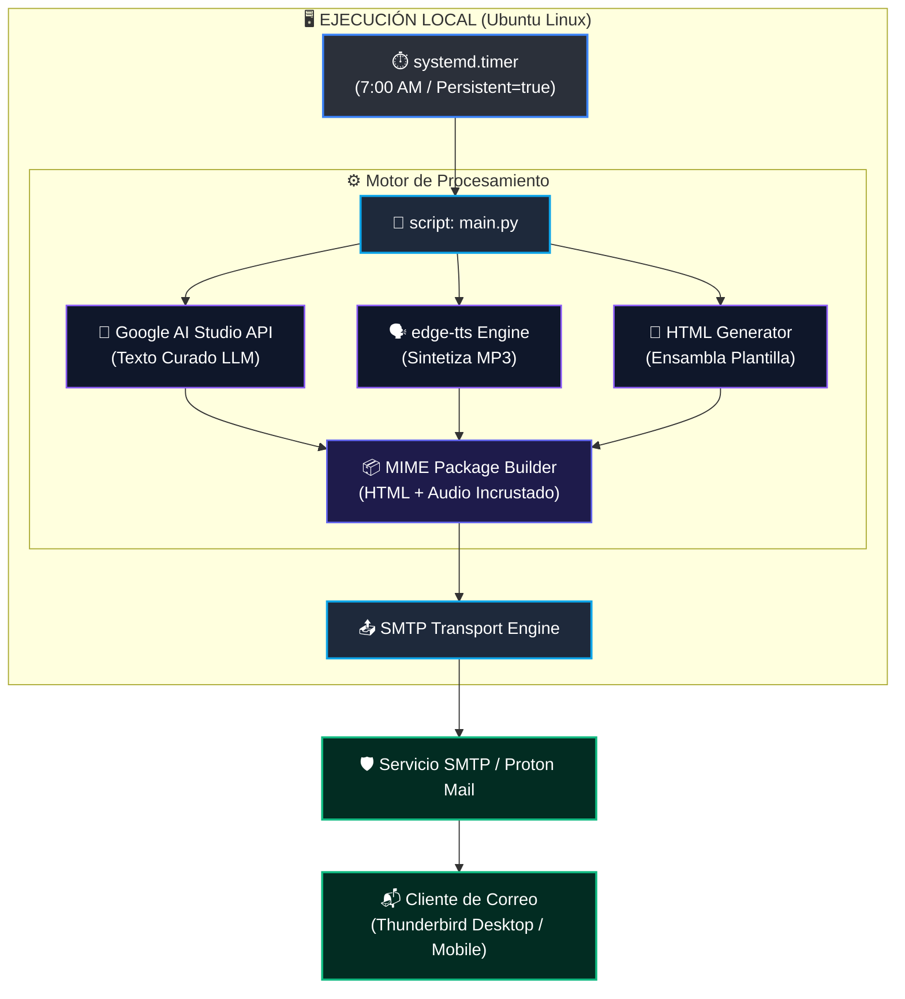

# 📰 Digest 13 — Daily News Digest & TTS Automation Pipeline

Digest 13 es un servicio de automatización local para la generación, síntesis de voz y entrega diaria de un informe periodístico curado. 

El sistema consulta modelos de lenguaje a través de API, genera un resumen maquetado en HTML y un archivo de audio MP3 de alta fidelidad utilizando síntesis de voz neuronal (`edge-tts`), enviando el paquete consolidado por correo electrónico para un consumo multisensorial (lectura + audio en paralelo) desde clientes como Thunderbird.

---

## 📐 Arquitectura del Sistema



---

## 📋 Requerimientos del Sistema

* **Sistema Operativo:** Linux (Probado y optimizado para Ubuntu 24.04 LTS / 26.04 LTS).
* **Lenguaje:** Python 3.10 o superior.
* **Dependencias de Python:**
* `google-genai` (Cliente oficial de la API de Gemini).
* `edge-tts` (Síntesis de voz neuronal de Microsoft Edge).
* `python-dotenv` (Manejo de variables de entorno).

* **Servicios Externos:**
* API Key de Google AI Studio (Gratuito / Tier Estándar).
* Cuenta de correo dedicada para el envío de notificaciones (se recomienda usar una cuenta aislada como Proton Mail con credenciales dedicadas para minimizar riesgos de seguridad).

---

## 📦 Aislamiento y Estructura Autocontenida

Para garantizar que el proyecto no contamine el sistema de archivos global (`~/.cache/`, `~/.local/`), **Digest 13** exige las siguientes directrices de arquitectura:

1. **Directorio de Cache Local:** Todas las librerías que generen caché temporal o descarguen recursos deben redirigir sus salidas a `digest-13/.cache/`.
   
   ```python
   import os
   from pathlib import Path
   ```

PROJECT_ROOT = Path(__file__).parent.resolve()
os.environ["HF_HOME"] = str(PROJECT_ROOT / ".cache" / "huggingface")
os.environ["XDG_CACHE_HOME"] = str(PROJECT_ROOT / ".cache")
os.environ["TORCH_HOME"] = str(PROJECT_ROOT / ".cache" / "torch")

```
2. **Aceleración por GPU (NVIDIA Quadro T2000 / Turing 4GB VRAM):** En caso de integrar módulos locales opcionales de procesamiento futuro (vía PyTorch u ONNX), el código debe detectar la GPU mediante CUDA (`device = 'cuda'`) utilizando precisión `float16` o cuantización de 4 bits (`INT4`) para operar dentro del límite de memoria de la tarjeta.
3. **Limpieza en Git:** El archivo `.gitignore` debe excluir todo archivo o caché local generado.

---

## 🛠️ Configuración e Instalación

### 1. Clonar el repositorio y preparar el entorno

```bash
git clone [https://github.com/tu-usuario/digest-13.git](https://github.com/tu-usuario/digest-13.git)
cd digest-13

python3 -m venv venv
source venv/bin/activate
pip install -r requirements.txt
```

### 2. Configurar Variables de Entorno (`.env`)

Crea un archivo `.env` en la raíz del proyecto. **Nunca subas este archivo al repositorio Git**.

```ini
# Configuración de Google AI Studio API
GEMINI_API_KEY="AIzaSyYourAPIKeyHere..."

# Configuración de la Voz (TTS)
TTS_VOICE="es-CR-MariaNeural"

# Configuración SMTP (Cuenta de envío aislada - p. ej. Proton Mail)
SMTP_SERVER="127.0.0.1"        # O el servidor SMTP de tu proveedor aislado
SMTP_PORT=1025                 # Puerto correspondiente
SMTP_USERNAME="tu_usuario_noticias"
SMTP_PASSWORD="tu_password_de_aplicacion"

# Remitente y Destinatario
EMAIL_FROM="noticias-bot@domain.com"
EMAIL_TO="tu_cuenta_proton@proton.me"
```

---

## 🎯 Prompt de Calibración Integrado

El backend en Python debe enviar el siguiente prompt exacto al modelo de lenguaje para garantizar la maquetación en bloques independientes, evitando párrafos masivos o respuestas continuas:

```text
Actúa como un editor y analista de prensa internacional. Tu tarea es elaborar un informe diario de noticias con un enfoque técnico, analítico, riguroso y sin sensacionalismo.

REGLAS STRICTAS DE FORMATO Y ESTRUCTURA:
- Cada sección DEBE contener notas periodísticas 100% INDEPENDIENTES entre sí.
- Queda ESTRICTAMENTE PROHIBIDO redactar ensayos continuos, fusionar noticias dentro de un mismo párrafo o usar conectores como "Por otro lado", "En paralelo" o "En materia de...".
- Cada noticia DENTRO de una sección DEBE llevar obligatoriamente esta estructura:
  ### [Título descriptivo y directo de la noticia]
  [Un único párrafo explicativo de 3 a 5 oraciones que detalle: el HECHO, el CONTEXTO y la IMPLICACIÓN técnica o política.]

CONTENIDO Y COBERTURA POR SECCIÓN:

1. GEOPOLÍTICA Y AMÉRICA LATINA (Fuentes de referencia tipo The Guardian)
   - Selecciona entre 3 y 5 acontecimientos globales de alto impacto.
   - Proporción obligatoria: Incluye al menos 1 o 2 temas relevantes de América Latina o el Sur Global para evitar un sesgo puramente eurocéntrico.

2. POLÍTICA Y SOCIEDAD COSTARRICENSE (Fuentes de referencia tipo Delfino.cr)
   - Selecciona entre 3 y 5 temas sobre la realidad institucional, económica y social de Costa Rica.
   - Prioriza la fiscalización del poder público, decisiones judiciales/legislativas y variables macroeconómicas/fiscales.
   - EXCLUSIÓN ABSOLUTA: Farándula, deportes, sucesos amarillistas y comunicados de prensa corporativos.

3. TECNOLOGÍA, FOTOGRAFÍA Y CULTURA DIGITAL
   - Selecciona entre 1 y 2 temas de fondo.
   - Enfoque: Infraestructura de IA, ciberseguridad, soberanía de software, privacidad, o debates sobre fotografía técnica y óptica dedicada frente al procesamiento sintético.
   - EXCLUSIÓN ABSOLUTA: Lanzamientos de teléfonos, "gadgets" menores o contenido promocional.

Tono: Imparcial, directo, técnico y de nivel profesional.
```

---

## 🎨 Plantilla HTML de Salida

El script debe encapsular el texto generado e incrustar el audio en la siguiente plantilla HTML responsiva para garantizar que la barra de reproducción esté visible en la parte superior:

```html
<!DOCTYPE html>
<html lang="es">
<head>
    <meta charset="UTF-8">
    <meta name="viewport" content="width=device-width, initial-scale=1.0">
    <title>Digest 13 - Informe Diario</title>
    <style>
        body {
            font-family: system-ui, -apple-system, BlinkMacSystemFont, 'Segoe UI', Roboto, Oxygen, Ubuntu, Cantarell, sans-serif;
            line-height: 1.6;
            color: #24292e;
            max-width: 800px;
            margin: 0 auto;
            padding: 20px;
            background-color: #f6f8fa;
        }
        .container {
            background: #ffffff;
            padding: 30px;
            border-radius: 8px;
            box-shadow: 0 1px 3px rgba(0,0,0,0.12);
        }
        .audio-player {
            position: sticky;
            top: 0;
            background: #f1f3f5;
            padding: 15px;
            border-radius: 6px;
            margin-bottom: 25px;
            border: 1px solid #e1e4e8;
            z-index: 100;
        }
        audio {
            width: 100%;
        }
        h1 { border-bottom: 2px solid #eaecef; padding-bottom: 10px; font-size: 1.5rem; color: #0366d6; }
        h2 { font-size: 1.2rem; margin-top: 30px; color: #24292e; border-bottom: 1px solid #eaecef; padding-bottom: 5px; }
        h3 { font-size: 1rem; color: #005cc5; margin-top: 20px; }
        p { text-align: justify; margin-bottom: 15px; }
    </style>
</head>
<body>
    <div class="container">
        <div class="audio-player">
            <p style="margin:0 0 8px 0; font-weight:bold; font-size:0.85rem; color:#586069;">🎧 ESCUCHAR DIGEST 13:</p>
            <audio controls src="cid:audio_resumen_mp3"></audio>
        </div>
        <!-- TEXTO DEL BOLETÍN GENERADO POR EL LLM -->
        {{CONTENIDO_NOTICIAS_HTML}}
    </div>
</body>
</html>
```

---

## ⚙️ Automatización en Linux mediante `systemd`

Para ejecutar Digest 13 diariamente a primera hora sin importar si la computadora estuvo apagada, crea los siguientes dos archivos en `~/.config/systemd/user/`:

### 1. `digest13.service`

```ini
[Unit]
Description=Servicio Digest 13 - Generacion de Noticias y TTS Diario
After=network-online.target
Wants=network-online.target

[Service]
Type=oneshot
WorkingDirectory=/ruta/a/tu/proyecto/digest-13
ExecStart=/ruta/a/tu/proyecto/digest-13/venv/bin/python main.py

[Install]
WantedBy=default.target
```

### 2. `digest13.timer`

```ini
[Unit]
Description=Timer Diario para Digest 13

[Timer]
OnCalendar=*-*-* 07:00:00
Persistent=true

[Install]
WantedBy=timers.target
```

### Habilitar el temporizador:

```bash
systemctl --user daemon-reload
systemctl --user enable --now digest13.timer
```

La directiva `Persistent=true` asegura que si la máquina estaba apagada a las 7:00 AM, el script detectará el evento pendiente y se ejecutará automáticamente unos segundos después de que enciendas el sistema.

---

## 🔒 Consideraciones de Seguridad

1. **Aislamiento de Credenciales:** La cuenta SMTP configurada para enviar los correos debe ser una cuenta secundaria (p. ej. Proton Mail con contraseña de aplicación o token aislado) sin privilegios sobre cuentas personales principales.
2. **Exclusión de Git:** Asegurarse de que `.env`, la carpeta `venv/`, el directorio `.cache/` y cualquier archivo `.mp3` o `.html` temporal generado estén especificados dentro de `.gitignore`:
   
   ```gitignore
   venv/
   .cache/
   .env
   *.mp3
   *.html
   ```

```

```

```
