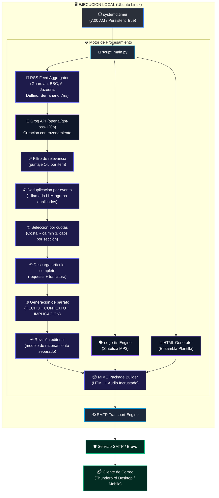

# 📰 Digest 13 — Daily News Digest & TTS Automation Pipeline

Digest 13 es un servicio de automatización local para la generación, síntesis de voz y entrega diaria de un informe periodístico curado. 

El sistema consulta modelos de lenguaje a través de API, genera un resumen maquetado en HTML y un archivo de audio MP3 de alta fidelidad utilizando síntesis de voz neuronal (`edge-tts`), enviando el paquete consolidado por correo electrónico para un consumo multisensorial (lectura + audio en paralelo) desde clientes como Thunderbird.

---

## 📐 Arquitectura del Sistema



---

## 📋 Requerimientos del Sistema

* **Sistema Operativo:** Linux (Probado y optimizado para Ubuntu 24.04 LTS / 26.04 LTS).
* **Lenguaje:** Python 3.10 o superior.
* **Dependencias de Python:**
* `groq` (Cliente oficial de la API de Groq).
* `edge-tts` (Síntesis de voz neuronal de Microsoft Edge).
* `python-dotenv` (Manejo de variables de entorno).
* `markdown` (Conversión Markdown → HTML).
* `feedparser` (Consumo de fuentes RSS).
* `requests` + `brotli` (Descarga de artículos con descompresión gzip/br).
* `trafilatura` (Extracción de texto limpio de artículos).

* **Servicios Externos:**
* API Key de Groq (Gratuito / Sin prepago necesario). Modelo `openai/gpt-oss-120b` con **200K tokens/día**; un run diario consume ~60-70K.
* Cuenta SMTP para envío de correos (Brevo, etc.).

---

## 📦 Aislamiento y Estructura Autocontenida

Para garantizar que el proyecto no contamine el sistema de archivos global (`~/.cache/`, `~/.local/`), **Digest 13** exige las siguientes directrices de arquitectura:

1. **Directorio de Cache Local:** Todas las librerías que generen caché temporal o descarguen recursos deben redirigir sus salidas a `digest-13/.cache/`.
   
   ```python
   import os
   from pathlib import Path

   PROJECT_ROOT = Path(__file__).parent.resolve()
   os.environ["HF_HOME"] = str(PROJECT_ROOT / ".cache" / "huggingface")
   os.environ["XDG_CACHE_HOME"] = str(PROJECT_ROOT / ".cache")
   os.environ["TORCH_HOME"] = str(PROJECT_ROOT / ".cache" / "torch")
   ```
2. **Aceleración por GPU (NVIDIA Quadro T2000 / Turing 4GB VRAM):** En caso de integrar módulos locales opcionales de procesamiento futuro (vía PyTorch u ONNX), el código debe detectar la GPU mediante CUDA (`device = 'cuda'`) utilizando precisión `float16` o cuantización de 4 bits (`INT4`) para operar dentro del límite de memoria de la tarjeta.
3. **Limpieza en Git:** El archivo `.gitignore` debe excluir todo archivo o caché local generado.

---

## 🛠️ Configuración e Instalación

### 1. Clonar el repositorio y preparar el entorno

```bash
git clone [https://github.com/tu-usuario/digest-13.git](https://github.com/tu-usuario/digest-13.git)
cd digest-13

python3 -m venv venv
source venv/bin/activate
pip install -r requirements.txt
```

### 2. Configurar Variables de Entorno (`.env`)

Crea un archivo `.env` en la raíz del proyecto. **Nunca subas este archivo al repositorio Git**.

```ini
# Configuración de Groq API
GROQ_API_KEY="gsk_tu_api_key_aqui..."
LLM_MODEL="openai/gpt-oss-120b"
EDITORIAL_MODEL="openai/gpt-oss-120b"

# Configuración de la Voz (TTS)
TTS_VOICE="es-CR-MariaNeural"

# Configuración SMTP
SMTP_SERVER="smtp-relay.brevo.com"
SMTP_PORT=587
SMTP_USERNAME="tu_usuario_smtp"
SMTP_PASSWORD="tu_password_smtp"

# Remitente y Destinatario
EMAIL_FROM="remitente@verified.com"
EMAIL_TO="destino@correo.com"
```

---

## 📡 Fuentes RSS Agregadas

El pipeline recolecta titulares y sumarios de las siguientes fuentes RSS antes de enviarlos al LLM como contexto:

| Sección | Fuentes RSS |
|---------|-------------|
| Geopolítica y América Latina | The Guardian (world + americas), BBC News, Al Jazeera |
| Política y Sociedad Costarricense | Delfino.cr, Semanario Universidad |
| Tecnología, Infraestructura y Software | The Guardian (technology), Ars Technica |

Cada entrada incluye su fuente (`[The Guardian]`). El título de cada noticia se convierte en un hipervínculo al artículo original (`### [Título](url)`). El contexto RSS se inyecta antes del prompt con la instrucción de basarse únicamente en esos resultados.

---

## 🗣️ Limpieza de Texto para TTS

Antes de la síntesis de voz, el texto markdown generado por el LLM se limpia mediante `text_cleaner.strip_markdown()` para eliminar:
- Encabezados (`#` a `######`)
- Negritas (`**texto**`) y cursivas (`*texto*`)
- Enlaces markdown (`[texto](url)`)
- Código inline (`` `codigo` ``)
- Listas (`- `, `1. `)
- Citas (`> `)

Esto evita que el TTS lea en voz alta símbolos de formato.

---

## 🎯 Pipeline de Curación (LLM + Cuotas)

El pipeline usa dos modelos: `llama-3.3-70b-versatile` para el volumen (etapas 1-5) y `openai/gpt-oss-120b` —modelo *reasoning*— para la revisión editorial (etapa 6). `call_llm` acepta `model` por llamada. Reintenta en 429 solo para rate limits transitorios; el agotamiento de cuota diaria (TPD) falla rápido sin reintentos fútiles.

### Etapa 1 — Filtro de relevancia (`relevance.py`)

Cada item RSS se evalúa con puntaje **1 a 5** y se reasigna a una sección. Respuesta en formato estricto:

```text
PUNTAJE: [1-5]
ACCIÓN: [APROBAR|RECHAZAR]
SECCIÓN: [GEOPOLÍTICA Y AMÉRICA LATINA|POLÍTICA Y SOCIEDAD COSTARRICENSE|TECNOLOGÍA, INFRAESTRUCTURA Y SOFTWARE]
MOTIVO: [razón breve]
```

- **5** = IMPERDIBLE (impacto global directo, crisis mayor, cambio de políticas)
- **4** = ALTA RELEVANCIA (afecta significativamente a la región o sector)
- **3** = RELEVANCIA MEDIA (informativo, contexto útil)
- **2** = BAJA RELEVANCIA (tangencial, rumor, especulación)
- **1** = RECHAZAR

Criterios de rechazo (PUNTAJE = 1): deportes/fútbol, efemérides/aniversarios, noticias universitarias (SINDEU, fedes), comunicados de prensa corporativos, pifias diplomáticas/mapas errados, lanzamientos de gadgets de consumo, videojuegos a precio completo, **pseudociencia/medicina alternativa/homeopatía**, **contenido antivacunas**, **reportajes sobre doulas/partos no asistidos como alternativa a la atención médica profesional**.

### Etapa 2 — Deduplicación por evento (`relevance.py: deduplicate_by_event`)

Una sola llamada LLM recibe los top-20 candidatos (ID, sección, fuente, título, fragmento de resumen) y responde `GRUPO: [IDs]` por cada grupo de items que cubren el **mismo evento**. Se conserva el de mayor puntaje de cada grupo. Esto resuelve el caso de varias fuentes RSS cubriendo la misma noticia de última hora con redacción distinta (p. ej. la crisis de Ceuta en BBC + Guardian). Un filtro determinista por similitud de keywords (umbral 0.65) en la selección complementa para duplicados casi idénticos.

### Etapa 3 — Selección por cuotas (`main.py: select_by_quota`)

Tras la dedup, se seleccionan items por puntaje respetando cuotas por sección:

| Sección | Cuota |
|---------|-------|
| GEOPOLÍTICA Y AMÉRICA LATINA | máx 6 |
| POLÍTICA Y SOCIEDAD COSTARRICENSE | mín 3, máx 5 |
| TECNOLOGÍA, INFRAESTRUCTURA Y SOFTWARE | máx 5 |
| **Total** | **máx 15 items** (~10-12 min de audio) |

Pase 1: se fuerza el mínimo de Costa Rica. Pase 2: se llenan los cupos restantes por puntaje global, respetando los máximos por sección.

### Etapa 4 — Descarga de artículo completo (`article_fetcher.py`)

Uso de `requests` con headers de navegador y `Accept-Encoding: gzip, deflate, br`, descompresión manual (Semanario Universidad devuelve gzip que trafilatura no descomprime). El HTML se decodifica y se extrae texto con `trafilatura`. Umbral mínimo de 100 caracteres.

### Etapa 5 — Generación de párrafo (`paragraph_gen.py`)

```text
### [Título descriptivo y directo](url_del_artículo)
[Párrafo de 3 a 5 oraciones: HECHO con cifras/nombres/fechas, CONTEXTO, IMPLICACIÓN.]
```

El LLM genera solo título y párrafo. En Python, se inyecta la URL real del `Item` en el título (`### [título](url)`) — el modelo nunca escribe la URL. Prohibido: "es importante", "genera debate", "situación delicada", "es un logro/paso". Solo datos. Entrada truncada a 2500 caracteres, `max_tokens=800`, temperatura 0.4.

### Etapa 6 — Revisión editorial (`editorial_review.py`)

El informe completo (máx 8000 caracteres) se envía al modelo `EDITORIAL_MODEL` (por defecto `openai/gpt-oss-120b`, un modelo de razonamiento con cuota diaria propia) para una segunda pasada que verifica: estructura (`### [Título](url)` + párrafo), ausencia de frases vagas, uso de datos concretos y **detección de dos noticias que cubren el mismo evento**. Responde `APROBADO` o una lista de correcciones específicas. `max_tokens=1500`, temperatura 0.2.

---

## 🎨 Plantilla HTML de Salida

El script debe encapsular el texto generado e incrustar el audio en la siguiente plantilla HTML responsiva para garantizar que la barra de reproducción esté visible en la parte superior:

```html
<!DOCTYPE html>
<html lang="es">
<head>
    <meta charset="UTF-8">
    <meta name="viewport" content="width=device-width, initial-scale=1.0">
    <title>Digest 13 - Informe Diario</title>
    <style>
        body {
            font-family: system-ui, -apple-system, BlinkMacSystemFont, 'Segoe UI', Roboto, Oxygen, Ubuntu, Cantarell, sans-serif;
            line-height: 1.6;
            color: #24292e;
            max-width: 800px;
            margin: 0 auto;
            padding: 20px;
            background-color: #f6f8fa;
        }
        .container {
            background: #ffffff;
            padding: 30px;
            border-radius: 8px;
            box-shadow: 0 1px 3px rgba(0,0,0,0.12);
        }
        .audio-player {
            position: sticky;
            top: 0;
            background: #f1f3f5;
            padding: 15px;
            border-radius: 6px;
            margin-bottom: 25px;
            border: 1px solid #e1e4e8;
            z-index: 100;
        }
        audio {
            width: 100%;
        }
        h1 { border-bottom: 2px solid #eaecef; padding-bottom: 10px; font-size: 1.5rem; color: #0366d6; }
        h2 { font-size: 1.2rem; margin-top: 30px; color: #24292e; border-bottom: 1px solid #eaecef; padding-bottom: 5px; }
        h3 { font-size: 1rem; color: #005cc5; margin-top: 20px; }
        p { text-align: justify; margin-bottom: 15px; }
    </style>
</head>
<body>
    <div class="container">
        <div class="audio-player">
            <p style="margin:0 0 8px 0; font-weight:bold; font-size:0.85rem; color:#586069;">🎧 ESCUCHAR DIGEST 13:</p>
            <audio controls src="cid:audio_resumen_mp3"></audio>
        </div>
        <!-- TEXTO DEL BOLETÍN GENERADO POR EL LLM -->
        {{CONTENIDO_NOTICIAS_HTML}}
    </div>
</body>
</html>
```

---

## ⚙️ Automatización en Linux mediante `systemd`

Para ejecutar Digest 13 diariamente a primera hora sin importar si la computadora estuvo apagada, crea los siguientes dos archivos en `~/.config/systemd/user/`:

### 1. `digest13.service`

```ini
[Unit]
Description=Servicio Digest 13 - Generacion de Noticias y TTS Diario
After=network-online.target
Wants=network-online.target

[Service]
Type=oneshot
WorkingDirectory=/ruta/a/tu/proyecto/digest-13
ExecStart=/ruta/a/tu/proyecto/digest-13/venv/bin/python src/main.py

[Install]
WantedBy=default.target
```

### 2. `digest13.timer`

```ini
[Unit]
Description=Timer Diario para Digest 13

[Timer]
OnCalendar=*-*-* 07:00:00
Persistent=true

[Install]
WantedBy=timers.target
```

### Habilitar el temporizador:

```bash
systemctl --user daemon-reload
systemctl --user enable --now digest13.timer
```

La directiva `Persistent=true` asegura que si la máquina estaba apagada a las 7:00 AM, el script detectará el evento pendiente y se ejecutará automáticamente unos segundos después de que enciendas el sistema.

---

## 🔒 Consideraciones de Seguridad

1. **Aislamiento de Credenciales:** La cuenta SMTP configurada para enviar los correos debe ser una cuenta secundaria (p. ej. Proton Mail con contraseña de aplicación o token aislado) sin privilegios sobre cuentas personales principales.
2. **Exclusión de Git:** Asegurarse de que `.env`, la carpeta `venv/`, el directorio `.cache/` y cualquier archivo `.mp3` o `.html` temporal generado estén especificados dentro de `.gitignore`:
   
   ```gitignore
   venv/
   .cache/
   .env
   __pycache__/
   *.mp3
   *.html
   debug_news.txt
   ```

```

```

```
