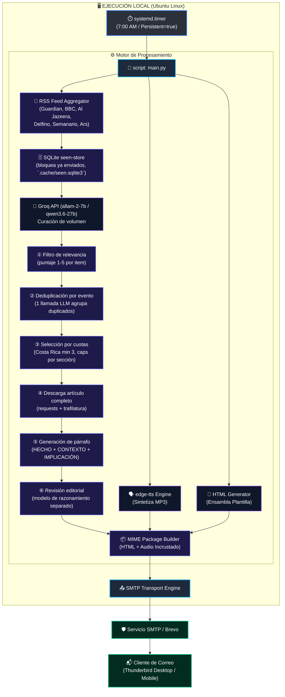

# 📰 Digest 13 — Daily News Digest & TTS Automation Pipeline

Digest 13 es un servicio de automatización local para la generación, síntesis de voz y entrega diaria de un informe periodístico curado. 

El sistema consulta modelos de lenguaje a través de API, genera un resumen maquetado en HTML y un archivo de audio MP3 de alta fidelidad utilizando síntesis de voz neuronal (`edge-tts`), enviando el paquete consolidado por correo electrónico para un consumo multisensorial (lectura + audio en paralelo) desde clientes como Thunderbird.

---

## 📐 Arquitectura del Sistema



---

## 📋 Requerimientos del Sistema

* **Sistema Operativo:** Linux (Probado y optimizado para Ubuntu 24.04 LTS / 26.04 LTS).
* **Lenguaje:** Python 3.10 o superior.
* **Dependencias de Python:**
* `groq` (Cliente oficial de la API de Groq).
* `edge-tts` (Síntesis de voz neuronal de Microsoft Edge).
* `python-dotenv` (Manejo de variables de entorno).
* `markdown` (Conversión Markdown → HTML).
* `feedparser` (Consumo de fuentes RSS).
* `requests` + `brotli` (Descarga de artículos con descompresión gzip/br).
* `trafilatura` (Extracción de texto limpio de artículos).

* **Servicios Externos:**
* API Key de Groq (Gratuito / Sin prepago necesario). Tres modelos con cuotas diarias **independientes**, asignados por etapa según cuánto importa la calidad de esa etapa:
  * `allam-2-7b` (`FILTER_MODEL`, no-reasoning) para clasificar: etapas 1 (relevancia) y 2 (dedup).
  * `qwen/qwen3.6-27b` (`LLM_MODEL`, reasoning) solo para redactar párrafos, etapa 5.
  * `openai/gpt-oss-120b` (`EDITORIAL_MODEL`, reasoning) solo para la revisión editorial final (etapa 6).
  Un run diario consume ~52K en total entre los tres. El reparto no es arbitrario: la etapa 1 hace una llamada por item (~44/día, el ~65% del gasto) y es la más barata conceptualmente — clasificar 1-5 contra una rúbrica explícita.
* **Fallback automático:** si un modelo agota su TPD (tokens per day), `call_llm()` cambia automáticamente al modelo de respaldo y **recuerda el agotamiento por el resto de la corrida** (`_exhausted` en `llm.py`), en vez de reintentar el modelo muerto en cada llamada. La cadena es explícita en `FALLBACK_CHAIN`:
  * `FILTER_MODEL` → `LLM_MODEL` (cae *hacia arriba*: sin modelo en la etapa 1 no se aprueba nada y la corrida aborta, así que gastar margen de párrafos es preferible a no publicar)
  * `LLM_MODEL` → `allam-2-7b` (volume fallback, non-reasoning)
  * `EDITORIAL_MODEL` → `openai/gpt-oss-20b` (200K TPD)
  Configurable via `FILTER_MODEL`, `VOLUME_FALLBACK` y `REASONING_FALLBACK` en `.env`.
* **No usar modelos de razonamiento en `FILTER_MODEL`.** Medido: una corrida con `gpt-oss-20b` como modelo de volumen gastó 1,173 tokens/llamada vs 832 de un modelo no-reasoning para el mismo trabajo (+41%), por la cadena de pensamiento oculta. Si alguna vez hiciera falta, el parámetro que realmente reduce esa generación es `reasoning_effort="low"` — `include_reasoning=False` solo la oculta de la respuesta.
* Cuenta SMTP para envío de correos (Brevo, etc.).

---

## 📦 Aislamiento y Estructura Autocontenida

Para garantizar que el proyecto no contamine el sistema de archivos global (`~/.cache/`, `~/.local/`), **Digest 13** exige las siguientes directrices de arquitectura:

1. **Directorio de Cache Local:** Todas las librerías que generen caché temporal o descarguen recursos deben redirigir sus salidas a `digest-13/.cache/`.
   
   ```python
   import os
   from pathlib import Path

   PROJECT_ROOT = Path(__file__).parent.resolve()
   os.environ["HF_HOME"] = str(PROJECT_ROOT / ".cache" / "huggingface")
   os.environ["XDG_CACHE_HOME"] = str(PROJECT_ROOT / ".cache")
   os.environ["TORCH_HOME"] = str(PROJECT_ROOT / ".cache" / "torch")
   ```
2. **Aceleración por GPU (NVIDIA Quadro T2000 / Turing 4GB VRAM):** En caso de integrar módulos locales opcionales de procesamiento futuro (vía PyTorch u ONNX), el código debe detectar la GPU mediante CUDA (`device = 'cuda'`) utilizando precisión `float16` o cuantización de 4 bits (`INT4`) para operar dentro del límite de memoria de la tarjeta.
3. **Limpieza en Git:** El archivo `.gitignore` debe excluir todo archivo o caché local generado.

---

## 🛠️ Configuración e Instalación

### 1. Clonar el repositorio y preparar el entorno

```bash
git clone [https://github.com/tu-usuario/digest-13.git](https://github.com/tu-usuario/digest-13.git)
cd digest-13

python3 -m venv venv
source venv/bin/activate
pip install -r requirements.txt
```

### 2. Configurar Variables de Entorno (`.env`)

Crea un archivo `.env` en la raíz del proyecto. **Nunca subas este archivo al repositorio Git**.

```ini
# Configuración de Groq API
GROQ_API_KEY="gsk_tu_api_key_aqui..."
FILTER_MODEL="allam-2-7b"                # etapas 1-2: clasificar (non-reasoning)
LLM_MODEL="qwen/qwen3.6-27b"            # etapa 5: redactar párrafos (reasoning)
EDITORIAL_MODEL="openai/gpt-oss-120b"    # etapa 6: revisión editorial (reasoning)

# Configuración de la Voz (TTS)
TTS_VOICE="es-CR-MariaNeural"

# SMTP — Opción A: Gmail (recomendado para uso personal)
# Requiere 2FA activado + Contraseña de Aplicación
# Ver: https://myaccount.google.com/security/app-passwords
# IMPORTANTE: la contraseña debe incluir los espacios tal como se muestran
SMTP_SERVER="smtp.gmail.com"
SMTP_PORT=587
SMTP_USERNAME="tu_correo@gmail.com"
SMTP_PASSWORD="xxxx xxxx xxxx xxxx"

# SMTP — Opción B: Brevo (para mayor volumen o dominio verificado)
# SMTP_SERVER="smtp-relay.brevo.com"
# SMTP_PORT=587
# SMTP_USERNAME="xxx@smtp-brevo.com"
# SMTP_PASSWORD="xsmtpsib-..."

EMAIL_FROM="tu_correo@gmail.com"
EMAIL_TO="tu_correo@gmail.com"
```

**Opción A vs Opción B:**

| | Opción A (Gmail) | Opción B (Brevo) |
|---|---|---|
| **Ideal para** | Uso personal, 1-5 correos/día | Mayor volumen, dominio propio |
| **Requisitos** | Cuenta Google + 2FA + Contraseña de Aplicación | Cuenta Brevo + dominio verificado |
| **Deliverability** | Excelente (mismo FROM y SMTP) | Excelente (con DKIM/SPF configurado) |
| **Costo** | Gratis | Gratis hasta 300 correos/día |
| **Limitación** | 500 correos/día desde scripts | Requiere dominio propio para autenticación completa |

---

## 📡 Fuentes RSS Agregadas

El pipeline recolecta titulares y sumarios de las siguientes fuentes RSS antes de enviarlos al LLM como contexto:

| Sección | Fuentes RSS |
|---------|-------------|
| Mundo | The Guardian (world + americas), BBC News, Al Jazeera |
| Costa Rica | Delfino.cr, Semanario Universidad |
| Tecnología | The Guardian (technology), Ars Technica |

Cada entrada incluye su fuente (`[The Guardian]`). El título de cada noticia se convierte en un hipervínculo al artículo original (`### [Título](url)`). El contexto RSS se inyecta antes del prompt con la instrucción de basarse únicamente en esos resultados.

**Filtro de fecha:** solo se procesan artículos de las últimas 48 horas (UTC). Si una entrada no tiene fecha o es más vieja, se descarta automáticamente. Esto evita que noticias de días anteriores reaparezcan y consuman tokens innecesariamente.

### Criterio de selección de fuentes

**Esta lista es una decisión editorial deliberada, no el resultado de qué feeds estaban disponibles.** La sección de Costa Rica tiene solo dos fuentes a propósito. Cualquier propuesta de agregar fuentes —humana o de un agente— debe evaluarse primero contra este criterio y solo después por si su RSS y su extracción funcionan.

**El criterio: excluir contenido diseñado para generar división, no para informar.** El patrón a evitar no es una posición política, es un formato: la nota recurrente que existe para insinuar en vez de reportar. En el contexto costarricense eso incluye tanto la pieza que vincula rutinariamente a un diputado del Frente Amplio con Cuba o Venezuela como su espejo, el comunicado sindical de agitación. Ninguno de los dos aporta un hecho verificable nuevo; ambos entregan indignación con formato de noticia.

La razón por la que esto importa acá más que en otro boletín: Digest 13 se consume en privado, sin interacción en redes sociales y sin foro donde responder. Una noticia divisiva no genera debate ni contexto — solo deja el sedimento. El objetivo declarado del boletín es informar y edificar, así que el contenido que solo produce indignación no cumple ningún propósito, independientemente de a quién ataque.

Esto explica dos decisiones que en el código parecen arbitrarias:
- El criterio de rechazo `Noticias universitarias (logros estudiantiles, SINDEU, fedes, boletines)` en el prompt de `relevance.py` **no** es un filtro de ruido de prensa universitaria: es el filtro de contenido de agitación sindical aplicado sobre Semanario Universidad, cuya sección gremial es abundante.
- Semanario Universidad se conserva por su trabajo de investigación, no por su línea gremial. Delfino.cr se conserva por ser independiente y de línea moderada, comparable a The Guardian.

**Fuentes de Costa Rica ya evaluadas y descartadas** (revisadas el 2026-08-01 — no volver a proponerlas sin argumento nuevo):

| Fuente | Estado técnico | Razón del descarte |
|---|---|---|
| La Nación | RSS OK, 100 entradas, extrae bien | Línea editorial alineada con la cúpula empresarial costarricense (valoración del dueño del proyecto). Además tiene paywall, que haría fallar descargas de forma intermitente |
| El Observador | RSS OK, extrae bien | Línea editorial de derecha marcada (valoración del dueño del proyecto) |
| Radio/Noticias Monumental | RSS OK pero débil: nota más reciente de 17h y solo ~684 chars extraídos | **Propiedad opaca:** Albavisión (Remigio Ángel González) → Grupo Repretel → Central de Radios → Monumental. El descarte es por esa estructura; la debilidad del feed solo lo confirma |
| AmeliaRueda.com | **Sin RSS** — 404 en todas las rutas estándar | Doble descarte: no hay forma de consumirla con esta arquitectura, y la estructura de propiedad es la misma de Repretel (ver nota abajo). Decisión cerrada, no pendiente |
| CRHoy / «Costa Rica Hoy» (crhoy.com) | Feed inválido — **irrelevante para la decisión** | Descarte editorial, no técnico: no cumple el estándar periodístico del boletín. Si algún día su RSS funciona, **no** es motivo para reconsiderarla |
| La República | Feed inválido | Técnico — no evaluada editorialmente |

**Nota sobre concentración de propiedad**, que es el argumento estructural y verificable detrás de la cautela con el grupo Repretel: Albavisión administra ~25 canales de TV y ~68 radios en América Latina, y en Costa Rica controla cuatro canales y once radios vía Central de Radios. Reporteros Sin Fronteras señala explícitamente en su informe 2026 que en Costa Rica «la concentración de la propiedad de medios en pocos conglomerados limita el pluralismo», con el país en caída sostenida desde 2022 (puesto 38 de 180). Existe literatura académica específica sobre el caso (*Concentración y transnacionalización de medios en Costa Rica: Caso Albavisión*; *De pocas a menos manos: la concentración de medios en Costa Rica 1990-2017*). Lo documentado es el riesgo estructural al pluralismo — no un análisis de contenido que pruebe sesgo nota por nota.

**Sobre AmeliaRueda.com, para el registro:** el caso se investigó a fondo porque parecía tener argumentos a favor, y conviene dejar por qué no alcanzaron. En contra: Amelia Rueda es directora de información de Central de Radios —cargo ejecutivo *dentro* del grupo Repretel— y conduce *Nuestra Voz* en Radio Monumental, así que el sitio no es independiente de Repretel en términos estructurales. A favor: su unidad de datos, DataBaseAR, fue **uno de los dos únicos medios costarricenses** en el consorcio ICIJ de los Panama Papers; el otro fue Semanario Universidad, que este proyecto sí usa. Credenciales de investigación equivalentes, dentro de la estructura de propiedad que el criterio rechaza. **Resolución: queda fuera** — sin RSS no hay forma de consumirla, y con la misma propiedad de Repretel el matiz investigativo (de 2016) no compensa. No reabrir sin argumento nuevo.

**Estado de la sección Costa Rica: cerrada en dos fuentes** (Delfino.cr y Semanario Universidad). El universo de medios costarricenses con RSS utilizable y línea editorial aceptable está agotado, no sub-explorado. Si la sección repite ángulos del mismo evento en un día de noticia local dominante, la palanca es el mínimo de la cuota (`SECTION_QUOTAS["COSTA RICA"]["min"]`), **no** agregar fuentes.

---

## 🗣️ Limpieza de Texto para TTS

Antes de la síntesis de voz, el texto markdown generado por el LLM se limpia mediante `text_cleaner.strip_markdown()` para eliminar:
- Encabezados (`#` a `######`)
- Negritas (`**texto**`) y cursivas (`*texto*`)
- Enlaces markdown (`[texto](url)`)
- Código inline (`` `codigo` ``)
- Listas (`- `, `1. `)
- Citas (`> `)

Esto evita que el TTS lea en voz alta símbolos de formato.

Además, los números se convierten a letras (solo para TTS, el HTML conserva el texto original) mediante `num2words.py`:
- `.` o espacio = separador de miles (`2.300.500` → *dos millones trescientos mil quinientos*; `2 300 500` → igual)
- `,` = decimal (`3,5` → *tres coma cinco*; `29,18%` → *veintinueve coma dieciocho por ciento*)
- Números puros sin separadores se agrupan de derecha a izquierda en miles (`4000000` → *cuatro millones*)
- `%` adyacente (pegado o separado) se lee *por ciento*; `₡` ya resuelto por el paso de moneda
- Se dejan intactos horas (`7:00`), fechas (`07/08/2026`), tokens alfanuméricos (`PM2.5`, `4G`) y números pegados a otra palabra

---

## 🎯 Pipeline de Curación (LLM + Cuotas)

El pipeline usa tres modelos de Groq, cada uno con su propia cuota diaria, para no competir por el mismo presupuesto de tokens:

| Modelo | Uso | Etapas | `max_tokens` |
|--------|-----|--------|--------------|
| `allam-2-7b` (`FILTER_MODEL`, no-reasoning) | Volumen: clasificar y agrupar | 1 (relevancia), 2 (dedup) | 600 / 600 |
| `qwen/qwen3.6-27b` (`LLM_MODEL`, reasoning) | Calidad: redactar los párrafos | 5 (párrafo) | 800 |
| `openai/gpt-oss-120b` (`EDITORIAL_MODEL`, reasoning) | Revisión final de todo el informe ya armado | 6 (revisión editorial) | 8000 |

`call_llm` en `llm.py` acepta `model` por llamada (default `LLM_MODEL`); `relevance.py` pasa explícitamente `model=FILTER_MODEL` y `editorial_review.py` pasa `model=EDITORIAL_MODEL`, así que solo `paragraph_gen.py` usa el default. Como `gpt-oss-120b` es un modelo *reasoning* que gasta tokens en cadena de pensamiento oculta antes de responder, su `max_tokens` debe ser generoso o la respuesta llega vacía o truncada — `llm.py` loguea `⚠ TRUNCADO` cuando `finish_reason == "length"` para detectar esto sin adivinar. Los modelos no-reasoning no tienen ese costo oculto, pero se les dejan los mismos límites generosos por margen, no por necesidad. Reintenta en 429 solo para rate limits transitorios; el agotamiento de cuota diaria (TPD) falla rápido sin reintentos fútiles y se recuerda por el resto de la corrida.

El respaldo de cada modelo se resuelve con un dict explícito (`FALLBACK_CHAIN`), no infiriéndolo de la forma del argumento `model`: con tres primarios ya no hay manera confiable de adivinar a qué cuota pertenece quien llama.

### Etapa 1 — Filtro de relevancia (`relevance.py`)

Cada item RSS se evalúa con puntaje **1 a 5** y se reasigna a una sección. Respuesta en formato estricto:

```text
PUNTAJE: [1-5]
ACCIÓN: [APROBAR|RECHAZAR]
SECCIÓN: [MUNDO|COSTA RICA|TECNOLOGÍA]
MOTIVO: [razón breve]
```

- **5** = IMPERDIBLE (impacto global directo, crisis mayor, cambio de políticas)
- **4** = ALTA RELEVANCIA (afecta significativamente a la región o sector)
- **3** = RELEVANCIA MEDIA (informativo, contexto útil)
- **2** = BAJA RELEVANCIA (tangencial, rumor, especulación)
- **1** = RECHAZAR

Criterios de rechazo (PUNTAJE = 1): deportes/fútbol, efemérides/aniversarios, noticias universitarias (SINDEU, fedes), comunicados de prensa corporativos, pifias diplomáticas/mapas errados, lanzamientos de gadgets de consumo, videojuegos a precio completo, **pseudociencia/medicina alternativa/homeopatía**, **contenido antivacunas**, **reportajes sobre doulas/partos no asistidos como alternativa a la atención médica profesional**.

Si la respuesta del modelo no trae una línea `PUNTAJE:`/`ACCIÓN:` parseable, `_parse_score()`/`_parse_action()`
devuelven `None` y el item se descarta como `MALFORMADO` — **no** como `RECHAZADO`. Un modelo que ignora el
formato (p. ej. un fallback poco familiarizado con el prompt) no debe verse indistinguible de un día real de
pocas noticias relevantes; `filter_items()` avisa con un resumen `⚠ N/M respuestas malformadas` cuando esto pasa.

### Etapa 2 — Deduplicación por evento (`relevance.py: deduplicate_by_event`)

Una sola llamada LLM recibe los top-20 candidatos (ID, sección, fuente, título, fragmento de resumen) y responde `GRUPO: [IDs]` por cada grupo de items que cubren el **mismo evento**. Se conserva el de mayor puntaje de cada grupo. Esto resuelve el caso de varias fuentes RSS cubriendo la misma noticia de última hora con redacción distinta (p. ej. la crisis de Ceuta en BBC + Guardian). Un filtro determinista por similitud de keywords (umbral 0.65) en la selección complementa para duplicados casi idénticos.

**Estas etapas (1 y 2) son intra-corrida** y no resuelven la repetición *de un día para otro*: la ventana RSS de 48h re-introduce artículos del día anterior en el feed. La memoria persistente está en `seen_store.py`:

- **`mark_sent`** (solo tras un envío de correo exitoso, `main.py` marca los items que de verdad llegaron al digest) registra la URL normalizada y el título normalizado.
- **`is_blocked`** se consulta justo después del agregador y **antes** del filtro LLM (ahorra tokens de `FILTER_MODEL`): bloquea si la URL normalizada ya fue enviada, o si la misma fuente publicó la misma noticia con una URL nueva (clave `(source, title_key)`).
- Normalización de URL: `http`/`https` y `www.` unificados, path en minúsculas, query/fragmento descartados (los `?utm_*` de tracking no cuelan duplicados).
- **`note_seen`** registra todo lo que el pipeline ve (auditoría) pero **nunca bloquea**: una noticia que un día no alcanzó cuota o falló en la descarga puede aparecer otro día sin problema.
- `prune(30 días)` en cada arranque mantiene la tabla chica. Base en `.cache/seen.sqlite3` (gitignoreada).

### Etapa 3 — Selección por cuotas (`main.py: select_by_quota`)

Tras la dedup, se seleccionan items por puntaje respetando cuotas por sección:

| Sección | Cuota |
|---------|-------|
| MUNDO | máx 6 |
| COSTA RICA | mín 3, máx 5 |
| TECNOLOGÍA | máx 5 |
| **Total** | **máx 15 items** (~10-12 min de audio) |

Pase 1: se fuerza el mínimo de Costa Rica. Pase 2: se llenan los cupos restantes por puntaje global, respetando los máximos por sección.

**Piso mínimo de envío:** si tras generar los párrafos el total queda por debajo de `MIN_ITEMS_FOR_DIGEST`
(5), `main.py` aborta (`sys.exit(1)`, sin enviar correo) en vez de despachar un digest de un par de
noticias. Este piso existe porque la revisión editorial (Etapa 6) solo rechaza por *demasiadas* noticias
del mismo evento, no por *muy pocas* — un colapso silencioso en el filtro de relevancia (ver nota de
`MALFORMADO` en la Etapa 1) podía llegar hasta el envío sin que nada lo frenara.

### Etapa 4 — Descarga de artículo completo (`article_fetcher.py`)

Uso de `requests` con headers de navegador y `Accept-Encoding: gzip, deflate, br`, descompresión manual (Semanario Universidad devuelve gzip que trafilatura no descomprime). El HTML se decodifica y se extrae texto con `trafilatura`. Umbral mínimo de 100 caracteres.

### Etapa 5 — Generación de párrafo (`paragraph_gen.py`)

```text
### [Título descriptivo y directo](url_del_artículo)
[Párrafo de 3 a 5 oraciones: HECHO con cifras/nombres/fechas, CONTEXTO, IMPLICACIÓN.]
```

El LLM genera solo título y párrafo — nunca escribe la URL. En Python, una regex captura el texto del título de la línea `###` **tolerando que el modelo lo haya envuelto en corchetes o no** (`^###\s*\[?(.+?)\]?\s*$`) y lo reconstruye como `### [título](url)` con la URL real del `Item`. Esto evita tanto URLs inventadas por el modelo como corchetes duplicados (`[[título]]`) si el modelo copió el formato de ejemplo literalmente. Prohibido: "es importante", "genera debate", "situación delicada", "es un logro/paso". Solo datos. Entrada truncada a 2500 caracteres, `max_tokens=800`, temperatura 0.4.

### Etapa 6 — Revisión editorial (`editorial_review.py`)

El informe completo (`MAX_REVIEW_CHARS = 24000`, holgado sobre los ~12.5K que ocupa un digest de 15 noticias) se envía al modelo `EDITORIAL_MODEL` (por defecto `openai/gpt-oss-120b`, un modelo de razonamiento con cuota diaria propia) como **última línea de defensa de calidad**. El editor verifica:

- **RECHAZA** si detecta: formato roto (JSON, XML, thinking visible, viñetas), párrafos vacíos, contenido de farándula/basura, datos inventados, o más de 2 noticias del mismo evento
- **CORRIGE** si detecta: estructura incorrecta, frases vagas prohibidas, párrafos demasiado largos/cortos, noticias repetidas que deben fusionarse
- **APROBA** solo si el digest es apto para publicación

Si el editor responde `RECHAZADO`, `main.py` aborta el envío de correo y escribe el fallo en el log. `max_tokens=8000`, temperatura 0.2.

**El límite de entrada no es cosmético.** Con el tope anterior de 8000 caracteres el editor solo veía los primeros dos tercios del informe —la sección TECNOLOGÍA nunca se revisaba— y el corte caía a mitad de una URL, así que reportaba defectos inexistentes (un enlace partido parece roto; la noticia partida parece un título sin párrafo) y rechazaba informes que, viéndolos completos, aprueba. `_fit()` recorta solo en frontera de noticia (`\n### `) y avisa por consola cuando recorta. El veredicto de ambos lados (`APROBADO`/`RECHAZADO`) se compara con `_verdict()`, que quita markdown inicial: el modelo responde `**RECHAZADO:**` o `### APROBADO` de forma rutinaria, y un `startswith` pelado deja el gate **abierto**.

---

## 🎨 Plantilla HTML de Salida

El script debe encapsular el texto generado e incrustar el audio en la siguiente plantilla HTML responsiva para garantizar que la barra de reproducción esté visible en la parte superior:

```html
<!DOCTYPE html>
<html lang="es">
<head>
    <meta charset="UTF-8">
    <meta name="viewport" content="width=device-width, initial-scale=1.0">
    <title>Digest 13 - Informe Diario</title>
    <style>
        body {
            font-family: system-ui, -apple-system, BlinkMacSystemFont, 'Segoe UI', Roboto, Oxygen, Ubuntu, Cantarell, sans-serif;
            line-height: 1.6;
            color: #24292e;
            max-width: 800px;
            margin: 0 auto;
            padding: 20px;
            background-color: #f6f8fa;
        }
        .container {
            background: #ffffff;
            padding: 30px;
            border-radius: 8px;
            box-shadow: 0 1px 3px rgba(0,0,0,0.12);
        }
        .audio-player {
            position: sticky;
            top: 0;
            background: #f1f3f5;
            padding: 15px;
            border-radius: 6px;
            margin-bottom: 25px;
            border: 1px solid #e1e4e8;
            z-index: 100;
        }
        audio {
            width: 100%;
        }
        h1 { border-bottom: 2px solid #eaecef; padding-bottom: 10px; font-size: 1.5rem; color: #0366d6; }
        h2 { font-size: 1.2rem; margin-top: 30px; color: #24292e; border-bottom: 1px solid #eaecef; padding-bottom: 5px; }
        h3 { font-size: 1rem; color: #005cc5; margin-top: 20px; }
        p { text-align: justify; margin-bottom: 15px; }
    </style>
</head>
<body>
    <div class="container">
        <div class="audio-player">
            <p style="margin:0 0 8px 0; font-weight:bold; font-size:0.85rem; color:#586069;">🎧 ESCUCHAR DIGEST 13:</p>
            <audio controls src="cid:audio_resumen_mp3"></audio>
        </div>
        <!-- TEXTO DEL BOLETÍN GENERADO POR EL LLM -->
        {{CONTENIDO_NOTICIAS_HTML}}
    </div>
</body>
</html>
```

---

## ⚙️ Automatización en Linux mediante `systemd`

Para ejecutar Digest 13 diariamente a primera hora sin importar si la computadora estuvo apagada, crea los siguientes archivos en `~/.config/systemd/user/`.

### 1. `digest13.service` — servicio principal

```ini
[Unit]
Description=Servicio Digest 13 - Generacion de Noticias y TTS Diario
After=network-online.target
Wants=network-online.target
OnFailure=digest13-notify.service

[Service]
Type=oneshot
WorkingDirectory=/ruta/a/tu/proyecto/digest13
ExecStart=/ruta/a/tu/proyecto/digest13/venv/bin/python src/main.py

[Install]
WantedBy=default.target
```

La directiva `OnFailure=` dispara `digest13-notify.service` si el pipeline falla (exit code != 0). El script `main.py` ya retorna `sys.exit(1)` en los puntos de fallo crítico (filtro de relevancia vacío, sin noticias generadas).

### 2. `digest13.timer` — programador diario

```ini
[Unit]
Description=Timer Diario para Digest 13

[Timer]
OnCalendar=*-*-* 07:00:00
Persistent=true

[Install]
WantedBy=timers.target
```

La directiva `Persistent=true` asegura que si la máquina estaba apagada a las 7:00 AM, el script detectará el evento pendiente y se ejecutará automáticamente unos segundos después de que enciendas el sistema.

### 3. `digest13-notify.service` — notificación de fallo

```ini
[Unit]
Description=Notificación de fallo Digest 13

[Service]
Type=oneshot
ExecStart=/ruta/a/tu/proyecto/digest13/on-failure.sh %n
```

Recibe el nombre del servicio que falló como argumento. El script `on-failure.sh` registra el fallo en `logs/failures.log`.

### 4. `on-failure.sh` — script de registro de fallos

Ubicado en la raíz del proyecto. Crea `logs/failures.log` (gitignored) con una línea por cada fallo:

```
[2026-07-31 07:00:15] Digest 13 falló (exit code: digest13.service)
```

También puede invocarse manualmente después de ejecutar `main.py`:

```bash
./on-failure.sh $?
```

### Instalación

```bash
# Crear directorio de servicios
mkdir -p ~/.config/systemd/user/digest13.service.d

# Copiar archivos (ajustar WorkingDirectory y ExecStart)
# ... crear digest13.service, digest13.timer, digest13-notify.service ...

# Crear drop-in para OnFailure=
cat > ~/.config/systemd/user/digest13.service.d/override.conf << EOF
[Service]
OnFailure=digest13-notify.service
EOF

# Recargar y habilitar
systemctl --user daemon-reload
systemctl --user enable --now digest13.timer
```

### Verificación

```bash
# Ejecutar manualmente para probar
systemctl --user start digest13.service

# Verificar que el servicio corrió
systemctl --user status digest13.service

# Simular fallo (ejecutar sin GROQ_API_KEY)
GROQ_API_KEY="" ~/.config/systemd/user/../../digest13/venv/bin/python src/main.py
echo $?  # Debe mostrar 1

# Verificar que el log de fallos se creó
cat logs/failures.log
```

### Monitoreo

```bash
# Ver log de corridas (resumen de cada ejecución)
cat logs/digest13.log

# Ver últimas 5 corridas
tail -30 logs/digest13.log

# Ver logs del pipeline (últimas 24 horas)
journalctl --user -u digest13.service --since today

# Ver solo errores
journalctl --user -u digest13.service --since today -p err

# Ver log de fallos del script
cat logs/failures.log
```

**Formato del log de corridas** (`logs/digest13.log`):

```
=== 2026-08-01 07:00:15 ===
Items RSS: 42 | Aprobados: 18 | Seleccionados: 12
Artículos descargados: 11 | Párrafos generados: 11
Tokens:
  qwen/qwen3.6-27b: 45,230 tokens (12 llamadas)
  openai/gpt-oss-120b: 8,450 tokens (1 llamada)
  Total: 53,680 tokens
Estado: OK — correo enviado a rodneyara@gmail.com
```

El log se acumula (no se sobreescribe) y es gitignored. Ideal para monitorear el consumo de tokens a lo largo del tiempo.

### Alternativa: cron

Si preferís cron sobre systemd, agrega esta línea con `crontab -e`:

```cron
0 7 * * * cd /ruta/a/tu/proyecto/digest13 && ./venv/bin/python src/main.py >> logs/cron.log 2>&1 || ./on-failure.sh cron >> logs/failures.log
```

Nota: cron no tiene `Persistent=true` — si la máquina estaba apagada a las 7:00 AM, el run se pierde hasta mañana.

---

## 🔒 Consideraciones de Seguridad

1. **Aislamiento de Credenciales:** La cuenta SMTP configurada para enviar los correos debe ser una cuenta secundaria (p. ej. Proton Mail con contraseña de aplicación o token aislado) sin privilegios sobre cuentas personales principales.
2. **Exclusión de Git:** Asegurarse de que `.env`, la carpeta `venv/`, el directorio `.cache/` y cualquier archivo `.mp3` o `.html` temporal generado estén especificados dentro de `.gitignore`:
   
    ```gitignore
    venv/
    .cache/
    .env
    __pycache__/
    *.mp3
    *.html
    debug_news.txt
    logs/
    ```

```

```

```
